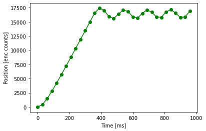
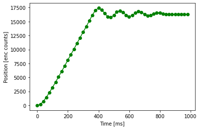
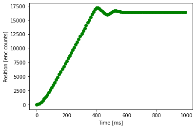
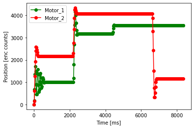
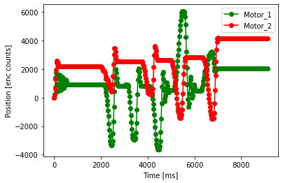

## Created by Tristan de Lemos, Trenten Spicer, and Rees Verleur
\
\
In this lab, we learned how to schedule tasks to control multiple motors simultaneously.
\
When running the program at a period length of 30 milliseconds, the motor plot, shown in Figure 1, becomes degraded and oscillates forever. 
When running the program at period length of 20 milliseconds, shown in Figure 2, the plot ends at a constant value rather than oscillating over it.
When running the program at the initial period of 10 milliseconds, shown inf Figure 3, the motor responds even better. Based on these three datapoints
we have selected a period of 20 milliseconds to run our motor controller at in the future.
\
Figure 1: Degraded step response at 30 ms

\
\
Figure 2: Partially degraded step response at 20 ms

\
\
Figure 3: Original step response at 10 ms

\
\
After performing this experiment, we adapted our code to run two motors simultaneously. We also adapted the C-Python program to accept two sets of input
data and sort/plot them accordingly. We wrote a test program which randomly varies both the s3etpoints and the gains (within defined ranges) of both motors
on a random interval of at least 5 seconds. This allows the user to reach in and adjust the position to inspect the response of the control loop to 
perturbation. Figure 4 shows one run where the motors are not perturbed. Figure 5 shows another run where the motors are perturbed.
\
Figure 4: Un-perturbed random test program for two motors.

\
\
Figure 5: Perturbed random test program for two motors

